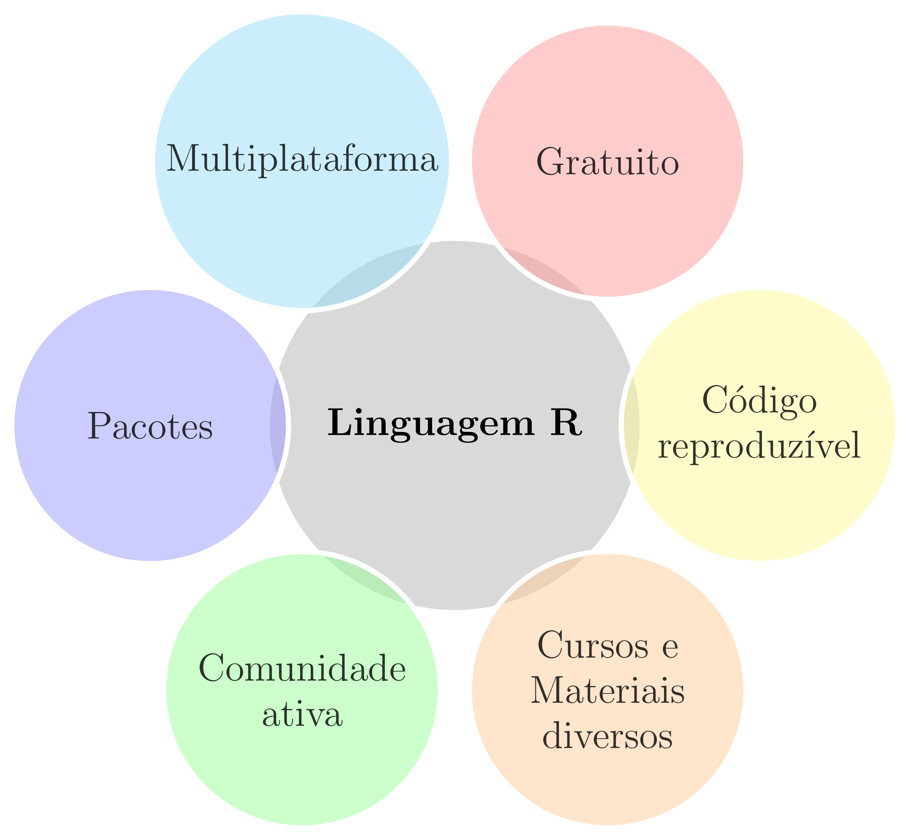
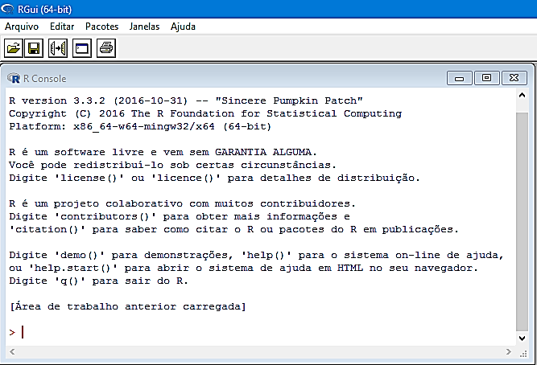
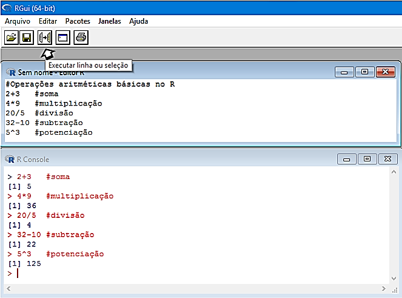
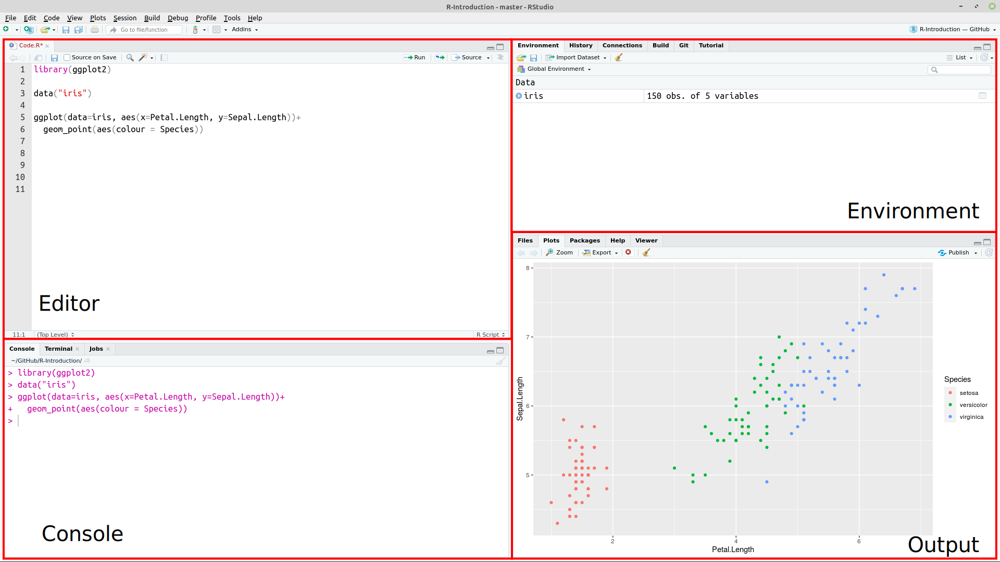

class: title-slide, center, middle
background-image: url(fig/slide-title/ufpa2.png), url(fig/slide-title/SIINGEF.jpg), url(fig/slide-title/ifap.png), url(fig/slide-title/img3.png)
background-position: 90% 90%, 50% 10%, 10% 90%
background-size: 250px, 250px, 200px, cover

```{r setup, include=FALSE}
knitr::opts_chunk$set(
	error = FALSE,
	fig.align = "center",
	fig.showtext = TRUE,
	message = FALSE,
	warning = FALSE,
	cache = FALSE,
	collapse = TRUE,
	dpi = 600
)
```

```{r packages, include=FALSE}
# remotes::install_github("dill/emoGG")
# remotes::install_github("hadley/emo")
library(ggplot2)
library(dplyr)
library(ggimage)
library(kableExtra)
library(readr)
library(emo)
```

```{css, echo=FALSE}
.with-logo::before {
	content: '';
	width: 120px;
	height: 120px;
	position: absolute;
	bottom: 1.3em;
	right: -0.3em;
	background-size: contain;
	background-repeat: no-repeat;
}

.logo-ufpa::before {
	background-image: url(fig/slide-title/ufpa.png);
}
```

```{r xaringan-logo, echo=FALSE}
library(xaringanExtra)
use_logo(
  image_url = "fig/slide-title/SIINGEF.jpg",
  position = css_position(top = "1.5em", right = "0.6em"),
  width = "140px",
  height = "140px"
)

use_scribble()

use_extra_styles(
  hover_code_line = TRUE,         #<<
  mute_unhighlighted_code = TRUE  #<<
)
xaringanExtra::use_editable(expires = 1)
#.can-edit[Você pode editar este título de slide]
#.can-edit.key-firstSlideTitle[Change this title and then reload the page]
use_clipboard()
```

```{r icon, echo=FALSE}
#remotes::install_github("mitchelloharawild/icons")
#remotes::install_github('emitanaka/anicon')
#library(icons)
#download_fontawesome()
#download_simple_icons()
```

```{r customDT, echo=F}
CustomDT <- function(data){
  data %>% DT::datatable(editable = 'cell', rownames = FALSE,
                         style = "default",
                         class = "display", width = '180px',
                         caption = '',
     options=list(pageLength = 10, dom = 'tip', autoWidth = F,
       initComplete = htmlwidgets::JS(
          "function(settings, json) {",
          paste0("$(this.api().table().container()).css({'font-size': '", "9pt", "'});"),
          "}")
       ) 
     )
}
```


<!-- title-slide -->

<br><br><br><br>
## .font90[Visualização de dados <br> `r anicon::faa("pagelines", animate="horizontal", colour="green")` com ggplot2 e extensões] `r anicon::faa("pagelines", animate="horizontal", colour="green")`

#### **Prof. Dr. Deivison Venicio Souza**
##### Universidade Federal do Pará (UFPA) 
##### Faculdade de Engenharia Florestal
##### E-mail: deivisonvs@ufpa.br
<br>
##### 1ª versão: 22/setembro/2021 <br> (Atualizado em: `r format(Sys.Date(),"%d/%B/%Y")`)

---

layout: true
class: with-logo logo-ufpa
<div class="my-header"></div>
<div class="my-footer"><span>Prof. Dr. Deivison Venicio Souza (E-mail: deivisonvs@ufpa.br)&emsp;&emsp;&emsp;&emsp;&emsp; <div2>Minicurso: Visualização de dados com ggplot2 e extensões</div2> </div>

---

<br>
## Objetivos
<br><br>
Ao final deste minicurso (.blue[Visualização de dados com ggplot2 e extensões]) espera-se que os participantes possam alcançar conhecimentos para...
<br><br>

* Construir gráficos no R usando funções do pacote **ggplot2**; e
* Combinar gráficos usando o pacote **Patchwork**.
<br><br>

.pull-left-7[
```{r echo=FALSE, out.width='50%', fig.align='center', fig.cap='', dpi=600}
knitr::include_graphics("https://tidyverse.tidyverse.org/articles/tidyverse-logo.png")
```
]

.pull-left-7[
```{r echo=FALSE, out.width='50%', fig.align='center', fig.cap='', dpi=600}
knitr::include_graphics("https://ggplot2.tidyverse.org/logo.png")
```
]

.pull-left-7[
```{r echo=FALSE, out.width='50%', fig.align='center', fig.cap='', dpi=600}
knitr::include_graphics("https://patchwork.data-imaginist.com/reference/figures/logo.png")
```
]

---

<br>
## Conteúdo

.pull-left-10[
.font80[
**Parte 1 - Conhecendo o R e o IDE Rstudio**

[1- A linguagem R](#R)

[2 - Por que usar a linguagem R?](#pqR)

[3 - RGui - Download, instalação e interface](#RGui)

[4 - IDE RStudio - Download, instalação e interface](#Rstudio)

]
]


.pull-right-10[
.font80[
**Parte 2 - Visualização de dados com .orange[ggplot2]**

[1 - Motivação](#mot)

[2 - O pacote ggplot2](#ggplot2)

[3 - Conjunto de dados - IF100%](#data)

[4 - Função ggplot()](#ggplot)

&nbsp;&nbsp;&nbsp;&nbsp;[4.1 - Camada base](#cb)

&nbsp;&nbsp;&nbsp;&nbsp;[4.2 - Especificando x e y](#xy)

[5 - Gráfico de pontos (dispersão)](#point)

&nbsp;&nbsp;&nbsp;&nbsp;[5.1 - Adicionando linha de regressão](#alr)

&nbsp;&nbsp;&nbsp;&nbsp;[5.2 - Modificando a cor dos pontos](#mcp)

&nbsp;&nbsp;&nbsp;&nbsp;[5.3 - Modificando a forma dos pontos](#mfp)

&nbsp;&nbsp;&nbsp;&nbsp;[5.4 - Modificando a tamanho dos pontos](#mtp)

&nbsp;&nbsp;&nbsp;&nbsp;[5.5 - Personalizando a forma e a cor dos pontos](#pfcp)

]
]


---

<br>
## Conteúdo

.pull-left-10[
.pull-down[
.font80[
**Parte 2 - Visualização de dados com .orange[ggplot2]** .green[**(cont.)**]

&nbsp;&nbsp;&nbsp;&nbsp;[5.6 - Modificando legendas](#ml)

&nbsp;&nbsp;&nbsp;&nbsp;[5.7 - Modificando títulos e escalas](#mte)

[6 - Gráficos de barras](#gb)

&nbsp;&nbsp;&nbsp;&nbsp;[6.1 - Gráfico de contagem por categoria](#gcc)

&nbsp;&nbsp;&nbsp;&nbsp;[6.2 - Gráfico de média por categoria](#gmc)

&nbsp;&nbsp;&nbsp;&nbsp;[6.3 - Modificando cores das barras](#mcb)

&nbsp;&nbsp;&nbsp;&nbsp;[6.4 - Reordenando as barras](#rb)

&nbsp;&nbsp;&nbsp;&nbsp;[6.5 - Adicionando rótulos nas barras](#arb)

&nbsp;&nbsp;&nbsp;&nbsp;[6.6 - Representando duas (ou mais) variáveis](#rdv)

[7 - Histograma e polígonos de frequências](#hist)

&nbsp;&nbsp;&nbsp;&nbsp;[7.1 - Controlando a largura da barra](#clb)

&nbsp;&nbsp;&nbsp;&nbsp;[7.2 - Compare distribuições entre categorias](#pol)

]
]
]


.pull-right-10[
.font80[

[8 - Boxplots](#box)

&nbsp;&nbsp;&nbsp;&nbsp;[8.1 - Compare distribuições](#box)

&nbsp;&nbsp;&nbsp;&nbsp;[8.2 - Reordenando os BoxPlots](#rbox)

&nbsp;&nbsp;&nbsp;&nbsp;[8.3 - Adicione símbolo para representar a média](#meanbox)

&nbsp;&nbsp;&nbsp;&nbsp;[8.4 - Represente vários grupos](#rvg)

&nbsp;&nbsp;&nbsp;&nbsp;[8.5 - Adicione pontos representativos dos dados](#aprd)

&nbsp;&nbsp;&nbsp;&nbsp;[8.6 - Adicione cores aos pontos por categoria](#acpc)

[9 - Matriz de painéis (facet)](#facet)

&nbsp;&nbsp;&nbsp;&nbsp;[9.1 - Represente categorias de uma varíavel](#rcv)

&nbsp;&nbsp;&nbsp;&nbsp;[9.2 - Represente categorias de duas (ou mais) variáveis](#rcdv)

&nbsp;&nbsp;&nbsp;&nbsp;[9.3 - Escalas dos eixos livres](#eel)

&nbsp;&nbsp;&nbsp;&nbsp;[9.4 - Modificando o texto do rótulo da faceta](#mtrf)

[10 - Salve um ggplot](#save)

]
]


---

<br>
## Conteúdo

.pull-left-10[
.pull-down[
.font80[
**Parte 3 - Combinação de gráficos com .orange[Patchwork]**

[1 - Combine gráficos com pacote "patchwork"](#patchwork)

[2 - Uso de operadores matemáticos](#adicao)

&nbsp;&nbsp;&nbsp;&nbsp;[2.1 - Operador adição](#adicao)

&nbsp;&nbsp;&nbsp;&nbsp;[2.2 - Operador divisão (empilhar)](#divisao)

&nbsp;&nbsp;&nbsp;&nbsp;[2.2 - Operador barra vertical (lado a lado)](#barra)

[3 - Disposição, área e legenda de subgráficos](#plotlayout)

&nbsp;&nbsp;&nbsp;&nbsp;[3.1 - Número de linhas e ordenação](#plotlayout)

&nbsp;&nbsp;&nbsp;&nbsp;[3.2 - Largura relativa dos subgráficos](#widths)

&nbsp;&nbsp;&nbsp;&nbsp;[3.3 - Altura relativa dos subgráficos](#heights)

&nbsp;&nbsp;&nbsp;&nbsp;[3.4 - Posição e remoção de legendas duplicadas](#guides)

[4 - Gráfico dentro de outro gráfico](#inset)

[5 - Adicione textos, títulos, tags](#annotation)

]
]
]

---

layout: false
name: conc
class: inverse, top, right
background-image: url(fig/slide-title/arara.jpg)
background-size: cover

.font200[**.yellow[Parte 1] <br> .white[Conhecendo o R e <br> o IDE Rstudio]**]

---

layout: true
class: with-logo logo-ufpa
<div class="my-header"></div>
<div class="my-footer"><span>Prof. Dr. Deivison Venicio Souza (E-mail: deivisonvs@ufpa.br)&emsp;&emsp;&emsp;&emsp;&emsp; <div2>Minicurso: Visualização de dados com ggplot2 e extensões</div2> </div>

---
name: R
## Linguagem R

.pull-left-4[
.font90[
- É uma linguagem de programação de computadores de código aberto e gratuita;
- Criada em 1993: Ross Ihaka e por Robert Gentleman;
- Departamento de Estatística da Universidade de Auckland, Nova Zelândia;
- O R foi desenvolvido a partir da Linguagem S.
]
]

.pull-right-4[
.font90[
**Possui múltiplas facetas:**

- Pacotes para implementação de métodos estatisticos;
- Pacotes para visualização gráfica elegantes;
- Pacotes para criação de aplicações web, Dashboard;
- Pacote para geração de relatórios dinâmicos;
- Pacotes para criação de apresentações elegantes.
]
]


.pull-left-7[
```{r echo=FALSE, out.width='30%', fig.align='center', fig.cap='', dpi=600}
knitr::include_graphics("https://blog.efpsa.org/wp-content/uploads/2019/04/pic1.png")

```

]

.pull-left-7[
```{r echo=FALSE, out.width='30%', fig.align='center', fig.cap='', dpi=600}
knitr::include_graphics("https://ggplot2.tidyverse.org/logo.png")
```
]

.pull-left-7[
```{r echo=FALSE, out.width='30%', fig.align='center', fig.cap='', dpi=600}
knitr::include_graphics("https://pkgs.rstudio.com/rmarkdown/reference/figures/logo.png")
```
]

.pull-left-7[
```{r echo=FALSE, out.width='30%', fig.align='center', fig.cap='', dpi=600}
knitr::include_graphics("https://tidyverse.tidyverse.org/articles/tidyverse-logo.png")
```
]

---
name: pqR
## Por que usar a linguagem R?

```{r, echo=FALSE, out.width='50%', fig.align='center', fig.cap='', dpi=600}

```

---
name: RGui
## RGui - Download e instalação
<br>

**1⁰ Passo**: Acessar a página do projeto R em: https://www.r-project.org/;

**2⁰ Passo**: Do lado esquerdo da página clique sobre o menu .green[CRAN];

**3⁰ Passo**: Será aberta uma página com diversos links de .green[CRAN Mirrors], isto é, espelhos CRAN. 
<br>
Veja na tabela a seguir os principais espelhos disponíveis no Brasil.
<br><br>

.center2[
```{r echo=FALSE}
df <- data.frame(Link = 
                   c("http://cran-r.c3sl.ufpr.br/",
                     "http://nbcgib.uesc.br/mirrors/cran/", 
                     "https://cran.fiocruz.br/",
                     "https://vps.fmvz.usp.br/CRAN/",
                     "http://brieger.esalq.usp.br/CRAN/"),
                 Instituição = 
                   c("Universidade Federal do Paraná - UFPR",
                     "Center for Comp Biol at Universidade Estadual de Santa Cruz",
                     "Oswaldo Cruz Foundation, Rio de Janeiro",
                     "University of São Paulo, São Paulo",
                     "University of São Paulo, Piracicaba")
                 )

df %>% 
   DT::datatable(editable = 'cell', rownames = FALSE, style = "default",
                 class = "display", width = '750px',
                 caption = '',
     options=list(pageLength = 10, dom = 'tip', autoWidth = F,
       initComplete = htmlwidgets::JS(
          "function(settings, json) {",
          paste0("$(this.api().table().container()).css({'font-size': '", "12pt", "'});"),
          "}")
       ) 
     )
```
]

---

## RGui - Download e instalação
<br>

**4⁰ Passo**: Na página http://cran-r.c3sl.ufpr.br/, na seção .green[Download and Install R], clicar em um dos três links, conforme o Sistema Operacional do usuário:

1. Download R for Windows;
2. Download R for Linux; ou
3. Download R for MacOS.
<br>

**5⁰ Passo**: Clicar no link do .green[subdiretório base] ou em o .green[install R for the first time] para instalar o R pela primeira vez;
<br>

**6⁰ Passo**: Clicar, por exemplo, em .green[Download R-4.1.0. for Windows] (.red[escolha seu SO]). Assim, será iniciado o download do R Development Core Team para o respectivo sistema; e
<br>

**7⁰ Passo**: Por fim, basta usar o setup baixado para instalar o programa.

---

## RGui - Interface
<br>

Ao inicializar o **R Development Core Team** pela primeira vez aparecerá a seguinte imagem:

```{r, echo=FALSE, out.width='50%', fig.align='center', fig.cap='R Console'}

```

---

## RGui - Interface

- No contato inicial do usuário com o RGui tem-se a visão do .green[R Console].
- O sinal .red[>] é o prompt de comando.
- Execute as funções .green[demo(), help(), help.start(), q()].

```{r, echo=FALSE, out.width='50%', fig.align='center', fig.cap='R Console'}

```

---

## RGui - R editor

O RGui possui um .green[R editor] $\rightarrow$ Abrir script.

```{r, echo=FALSE, out.width='50%', fig.align='center', fig.cap='R editor'}

```

---
name: Rstudio
## IDE RStudio - download e instalação
<br>

O .green[RStudio] é um ambiente de desenvolvimento integrado (*Integrated Development Environment - IDE*) de códigos em R mais comumente usado por usuários da linguagem.

**1⁰ Passo**: Acessar a página do projeto RStudio: https://www.rstudio.com;

**2⁰ Passo**: Products $\rightarrow$ RStudio;

**3⁰ Passo**: Selecionar a versão do RStudio para Desktop;

**4⁰ Passo**: Na edição Open source $\rightarrow$ Download Rstudio Desktop;

**5⁰ Passo**: Por fim, basta usar o setup baixado para instalar o programa.
<br><br>

```{r, echo=FALSE, out.width='30%', fig.align='center', fig.cap=''}
knitr::include_graphics('fig/slide-title/RStudio.png')
```

---

## IDE RStudio - Interface

```{r, echo=FALSE, out.width='80%', fig.align='center', fig.cap=''}

```
<!-- http://material.curso-r.com/rbase/ -->

---

## IDE RStudio - Interface (Painéis)
<br>

**Editor**: Painel de desenvolvimento dos códigos R.

**Environment**: Painel onde aparecerão todos os objetos criados no R.

**Console**: Painel para rodar os códigos R e receber outputs.

**Plots**: Painel de saída gráfica.

**History**: Painel que mostra um histórico dos comandos executados na sessão corrente.

**Help**: Painel que mostra a documentação de funções de pacotes, quando solicitada.

**Files**: Painel para identificar arquivos no diretório de trabalho.

**Packages**: Painel que mostra os pacotes instalados. É possível identificar os pacotes carregados na sessão corrente.


---

layout: false
name: conc
class: inverse, top, right
background-image: url(fig/slide-title/arara.jpg)
background-size: cover

.font200[**.yellow[Parte 2] <br> .white[Visualização de dados <br> com ggplot2]**]

.left[.footnote[.white[Créditos: Imagem de IvaCastro por Pixabay].]]

---

layout: true
class: with-logo logo-ufpa
<div class="my-header"></div>
<div class="my-footer"><span>Prof. Dr. Deivison Venicio Souza (E-mail: deivisonvs@ufpa.br)&emsp;&emsp;&emsp;&emsp;&emsp; <div2>Minicurso: Visualização de dados com ggplot2 e extensões</div2> </div>

---
name: mot
<br>
## Motivação

.font90[
- .blue[Dados] constituem uma representação usada para .blue[gerar informações sobre um fenômeno].
- Os .blue[gráficos são representações visuais] úteis para exibir .blue[informações ocultas nos dados].
- Representações visuais são .blue[melhor interpretadas] pelo cerébro humano.
- A natureza da variável e o objetivo da análise, em geral, orientam a melhor representação visual.
- O R-base possui diversas funções para visualização de dados. Por exemplo, .green[**plot()**], .green[**hist()**], .green[**barplot()**], .green[**boxplot()**], entre outras.
- O tidyverse incorpora o pacote .blue[**ggplot2**], um framework sensacional para construção de gráficos elegantes.
]
<br><br>

.center[**O pacote .blue[ggplot2] será o nosso objeto de estudo!**]

---
name: ggplot2
<br>
## O pacote ggplot2 (tidyverse)
<br>

.font90[
- O ggplot2 é um pacote para .blue[visualização de dados] disponível no R.
- O pacote foi desenvolvido por .blue[Hadley Wickham], inspirado pelo livro .blue[**The Grammar of graphics**] (A gramática dos gráficos) de .blue[Leland Wilkinson].
- A essência do ggplot2 é a construção de gráficos ".blue[camada por camada]".
- O ggplot2 possui .blue[vantagens] frente ao R-base:
  + É altamente customizável;
  + É mais elegante (bonito);
  + É muito intuitivo, devido a filosofia de camadas.
]

.pull-left-7[
```{r echo=FALSE, out.width='45%', fig.align='center', fig.cap='', dpi=600}
knitr::include_graphics("https://ggplot2.tidyverse.org/logo.png")
```
]


---
name: data
## Pacote ggplot2 (tidyverse)

.font80[
### Conjunto de dados - Amostra de Inventário Florestal 100%...
]
<br>

.font80[
.pull-left-4[
```{r data, echo=T, eval=F}
data <- readr::read_csv(file="data/UPA07DVS.csv") %>%
  mutate(DAP = round(CAP/pi, 2),
         V = round(((DAP^2*pi)/40000)*HC*0.7, 4))

set.seed(1000)

data_sample <- data %>%
  select(Nome_Especie, DAP, CAP, HC, QF, Selecao, V) %>%
  filter(Nome_Especie %in% c('Acapu', 'Andiroba',
                             'Maçaranduba', 'Goiabão')) %>%
  group_by(Nome_Especie) %>%
  sample_n(50, replace = F)

data_sample %>% CustomDT # apenas p/ uma saída elegante da tabela
```
<br>

**Vamos usar uma amostra de 4 espécies florestais de um IF100% para construir os gráficos...**

**A base completa pode ser acessada em**: [IF100%](https://deivisonsouza.github.io/FL03034-EF/Slides/data/UPA07DVS.csv)

]
]

.font80[
.pull-right-4[
```{r ref.label="data", echo=FALSE, eval=TRUE, collapse=T}
```
]
]

---
name: ggplot
## Pacote ggplot2 (tidyverse)
<br>
### Sintaxe Básica

.pull-left-2[
.font80[
- A estrutura de dados deve ser um .blue[data.frame]. Não admite matrizes, vetores, e outros!
- A função principal é .green[ggplot()].
- Nesta função os argumentos básicos são:
  + .blue[data]: argumento que recebe os dados no formato de **data.frame**.
  + .blue[mapping]: argumento que recebe informações das variáveis (x e y) a serem usadas na plotagem. Esses argumentos são passados dentro da função .blue[aes()].
<br><br>

Obs.: Se .blue[mapping] não for especificado na função .green[ggplot()], deve ser fornecido em cada camada adicionada ao gráfico.
]
]

---

## Pacote ggplot2 (tidyverse)
<br>
### Sintaxe Básica

- Existem 3 formas de invocar a função .green[ggplot()]:

.pull-left-8[
.font80[

.green[ggplot(.brown[df], aes(.blue[x], .blue[y], .blue[outras estéticas]))]
<br><br>

- Método é recomendado quando dados de **um único data.frame** e também as **mesmas estéticas** são usadas nas camadas adicionadas.
]
]

--

.pull-left-8[
.font80[
.center[.green[ggplot(.brown[df])]]
<br>

- Método é recomendado quando dados de **um único data.frame** é usado pelas camadas adicionadas, mas as **estéticas variam de uma camada para outra**.

]
]

--

.pull-left-8[
.font80[
.center[.green[ggplot()]]
<br>

- Método é recomendado quando **vários data.frames precisam ser usados para produzir diferentes camadas** no gráfico. É usual para gráficos complexos.
]
]

---
name: cb
## Pacote ggplot2 (tidyverse)
<br>
### Camada base

.pull-left-4[
.font80[

```{r gg, echo=T, eval=F}
ggplot(data = data_sample)
```

- A execução da função .green[ggplot()] (sem argumentos) ou com apenas o argumento .blue[data] especificado .green[ggplot(.blue[data] = .brown[data_sample])] gera simplesmente a base do gráfico (sem elementos estéticos e geométricos).
<br><br>

```{r echo=T, eval=F}
data_sample %>% ggplot()
```

- É comum usar o operador .blue[%>%] para enviar o conjunto de dados para a função .green[ggplot()].

]
]

.pull-right-4[
.font80[
```{r ref.label="gg", fig.width=6, fig.height=5, echo=F, eval=T}
```
]
]

---
name: xy
## Pacote ggplot2 (tidyverse)

.font80[
### Camada base - .black[Especificando x e y]
]
<br>

.pull-left-4[
.font80[

```{r gg2, echo=T, eval=F}
ggplot(data = data_sample,
       mapping = aes(x = DAP, y = HC)) # 1ª camada
```
<br>

- Adicionamos ".blue[x]" = DAP e ".blue[y]" = HC dentro da função .green[aes()] do argumento .blue[mapping].
- Isso informar que as variáveis DAP e HC devem ser usadas nos eixos x e y, respectivamente, do gráfico.
- Apesar disso, ainda não é possível visualizar um gráfico com elementos geométricos representativos dos dados.
- Então, é necessário definir o **tipo de gráfico** que deseja-se construir.

]
]

.pull-right-4[
.font80[
```{r ref.label="gg2", fig.width=6, fig.height=5, echo=F, eval=T}
```
]
]

---
name: point
## Pacote ggplot2 (tidyverse)
<br>
### Gráfico de pontos (dispersão)

.pull-left-4[
.font80[
**Útil para exibir a relação entre duas variáveis contínuas...**
```{r point1, echo=T, eval=F}
ggplot(data = data_sample,
       mapping = aes(x = DAP, y = V)) + # 1ª camada
  geom_point()                          # 2ª camada
```
<br>

`r emo::ji("point_right")` **2ª camada**:

- A função .green[geom_point()] foi usada para adicionar uma camada de pontos no gráfico. Tem-se um gráfico de dispersão.
- **Importante**: Para adicionar camadas usa-se o operador .red[**+**].

]
]

.pull-right-4[
.font80[
```{r ref.label="point1", fig.width=6, fig.height=5, echo=F, eval=T}
```
]
]

---
name: alr
## Pacote ggplot2 (tidyverse)

.font70[
### Gráfico de pontos (dispersão) - .black[Adicione linha de regressão]
]
<br>

.pull-left-4[
.font80[

```{r point2, echo=T, eval=F}
ggplot(data = data_sample,
       mapping = aes(x = DAP, y = V)) +       # 1ª camada
  geom_point() +                              # 2ª camada
  geom_smooth(method='lm', formula=y~x, se=F) # 3ª camada
```
<br>

`r emo::ji("point_right")` **3ª camada**:

- A função .green[geom_smooth()] foi usada para adicionar uma linha de regressão linear (y~x = V~DAP).
]
]

.pull-right-4[
.font80[
```{r ref.label="point2", fig.width=6, fig.height=5, echo=F, eval=T}
```
]
]

---

## Pacote ggplot2 (tidyverse)

.font70[
### Gráfico de pontos (dispersão) - .black[Adicione linha de regressão]
]
<br>

.pull-left-4[
.font80[

```{r point3, echo=T, eval=F}
ggplot(data = data_sample,
       mapping = aes(x = DAP, y = V)) +          # 1ª camada
  geom_point() +                                 # 2ª camada
  geom_smooth(method='lm', formula=y~x, se=F) +  # 3ª camada
  geom_smooth(method='lm', formula=y~poly(x,2),
              se=F, color = "red")               # 4ª camada
```
<br>

`r emo::ji("point_right")` **4ª camada**:

- A função .green[geom_smooth()] foi usada para adicionar outra linha de regressão, porém de um polinômio de segundo grau (y~x<sup>2</sup> = V~DAP<sup>2</sup>).
]
]

.pull-right-4[
.font80[
```{r ref.label="point3", fig.width=6, fig.height=5, echo=F, eval=T}
```
]
]

---
name: mcp
## Pacote ggplot2 (tidyverse)

.font50[
### Gráfico de pontos (dispersão) - .black[Modifique a cor dos pontos]
]
<br>

.pull-left-4[
.font70[
- Identificando os pontos pertencentes a cada espécie...

```{r point4, echo=T, eval=F}
ggplot(data = data_sample,
       mapping = aes(x = DAP, y = V)) +           # 1ª camada
  geom_point(mapping = aes(colour=Nome_Especie))  # 2ª camada
```
<br>

`r emo::ji("point_right")` **2ª camada**:
- A função .green[geom_point()] também possui argumentos para customização de atributos estéticos. (?geom_point).
- mapping: pode receber argumentos por meio da função .green[aes()]:

x, y, alpha, .magenta[**colour**], fill, group, shape, size, stroke

- O argumento .magenta[**colour**] recebeu a coluna "Nome_Especie" e mapeou diferentes cores para as categorias: Acapu, Andiroba, Goiabão, Maçaranduba.

]
]

.pull-right-4[
.font80[
```{r ref.label="point4", fig.width=6, fig.height=5, echo=F, eval=T}
```
]
]

---
name: mfp
## Pacote ggplot2 (tidyverse)

.font50[
### Gráfico de pontos (dispersão) - .black[Modifique a forma dos pontos]
]
<br>

.pull-left-4[
.font70[
```{r point5, echo=T, eval=F}
ggplot(data = data_sample,
       mapping = aes(x = DAP, y = V)) +           # 1ª camada
  geom_point(mapping = aes(colour=Nome_Especie,
                           shape=Selecao))        # 2ª camada
```
<br>

`r emo::ji("point_right")` **2ª camada**:

- O argumento .magenta[**shape**] recebeu a coluna "Selecao" e mapeou diferentes formas para as categorias: Explorar e Remanescente.
]
]

.pull-right-4[
.font80[
```{r ref.label="point5", fig.width=6, fig.height=5, echo=F, eval=T}
```
]
]

---
name: mtp
## Pacote ggplot2 (tidyverse)

.font50[
### Gráfico de pontos (dispersão) - .black[Tamanho proporcional]
]
<br>

.pull-left-4[
.font70[
- **Bubblechart** (gráfico de bolhas): É um gráfico de dispersão, em que uma terceira dimensão é adicionada.

```{r point6, echo=T, eval=F}
ggplot(data = data_sample %>% filter(Nome_Especie == 'Maçaranduba'),
       mapping = aes(x = DAP, y = V)) +           # 1ª camada
  geom_point(mapping = aes(colour = Selecao,
                           size = HC))            # 2ª camada
```
<br>

`r emo::ji("point_right")` **2ª camada**:

- O argumento .magenta[**size**] (dentro de .green[aes()]) recebeu a coluna "HC" e mapeou tamanhos de pontos proporcionais aos valores de HC.
- Portanto, a altura de cada árvore é representada pelo tamanho do círculo.
]
]

.pull-right-4[
.font80[
```{r ref.label="point6", fig.width=6, fig.height=5, echo=F, eval=T}
```
]
]

---

## Pacote ggplot2 (tidyverse)

.font70[
### Gráfico de pontos (dispersão) - .black[Modifique tamanho dos pontos]
]
<br>

.pull-left-4[
.font70[
- Aumentando tamanho de todos os pontos, mas na mesma proporção...

```{r point7, echo=T, eval=F}
ggplot(data = data_sample %>%
           filter(Nome_Especie %in% c('Acapu', 'Maçaranduba')),
       mapping = aes(x = DAP, y = V)) +           # 1ª camada
  geom_point(mapping = aes(colour = Nome_Especie,
                           shape = Selecao),
             size = 4)                            # 2ª camada
```
<br>

`r emo::ji("point_right")` **2ª camada**:

- Isso é feito com argumento .magenta[**size**], porém fora de .green[aes()].
- Especifique um valor inteiro para o argumento.
]
]

.pull-right-4[
.font80[
```{r ref.label="point7", fig.width=6, fig.height=5, echo=F, eval=T}
```
]
]

---
name: pfcp
## Pacote ggplot2 (tidyverse)

.font60[
### Gráfico de pontos (dispersão) - .black[Personalize a forma e a cor dos pontos]
]
<br>

.pull-left-4[
.font70[
```{r point8, echo=T, eval=F}
ggplot(data = data_sample %>%
           filter(Nome_Especie %in% c('Andiroba', 'Maçaranduba')),
       mapping = aes(x = DAP, y = V)) +               # 1ª camada
  geom_point(mapping = aes(colour = Nome_Especie,
                           shape = Selecao),
             size = 4) +                              # 2ª camada
  scale_shape_manual(values = c(3, 5)) +              # 3ª camada
  scale_color_manual(values = c('#F1C40F','#DE3163')) # 4ª camada
```
<br>

`r emo::ji("point_right")` **3ª e 4ª camadas**:

- Use .green[scale_shape_manual()] e .green[scale_color_manual()] para definir a forma e cor desejada para os pontos (e muito mais), respectivamente.
]
]

.pull-right-4[
.font80[
```{r ref.label="point8",fig.width=6, fig.height=5, echo=F, eval=T}
```
]
]

---

## Pacote ggplot2 (tidyverse)

.font70[
### Gráfico de pontos (dispersão) - .black[Tipos de formas (shapes)]
]
<br>

```{r echo=F, eval=T, out.width='35%'}
shapes <- data.frame(
  shape = c(0:19, 22, 21, 24, 23, 20),
  x = 0:24 %/% 5,
  y = -(0:24 %% 5)
)

ggplot(shapes, aes(x, y)) +
  geom_point(aes(shape = shape), size = 10, fill = "red") +
  geom_text(aes(label = shape), size=7, hjust = 0, nudge_x = 0.15) +
  scale_shape_identity() +
  expand_limits(x = 4.1) +
  theme_void()
```


---
name: ml
## Pacote ggplot2 (tidyverse)

.font70[
### Gráfico de pontos (dispersão) - .black[Modifique legendas]
]
<br>

.pull-left-4[
.font70[
```{r point9, echo=T, eval=F}
ggplot(data = data_sample %>%
           filter(Nome_Especie %in% c('Andiroba', 'Maçaranduba')),
       mapping = aes(x = DAP, y = V)) +                 # 1ª camada
  geom_point(mapping = aes(colour = Nome_Especie,
                           shape = Selecao),
             size = 4) +                                # 2ª camada
  scale_shape_manual(values = c(3, 5),
                     labels = c("Árvore para explorar",
                                "Árvore remanescente"),
                     name = "Seleção") +                # 3ª camada
  scale_color_manual(values = c('#999999','#E69F00'),
                     labels = c("Carapa guianensis",
                                "Manilkara elata"),
                     name = "Espécie")                  # 4ª camada
```
<br>

`r emo::ji("point_right")` **3ª e 4ª camadas**:

- Use .green[scale_shape_manual()] e .green[scale_color_manual()] para modificar as legendas atribuídas a partir das variáveis mapeadas em .blue[shape] e .blue[color] de .green[geom_point()], respectivamente.
- Explore os argumentos .blue[labels] e .blue[name].
]
]

.pull-right-4[
.font80[
```{r ref.label="point9",fig.width=6, fig.height=5, echo=F, eval=T}
```
]
]

---

## Pacote ggplot2 (tidyverse)

.font70[
### Gráfico de pontos (dispersão) - .black[Modifique títulos e escalas]
]
<br>

.pull-left-4[
.font70[
```{r point10, echo=T, eval=F}
ggplot(data = data_sample %>%
           filter(Nome_Especie %in% c('Andiroba', 'Maçaranduba')),
       mapping = aes(x = DAP, y = V)) +                 # 1ª camada
  geom_point(mapping = aes(colour = Nome_Especie,
                           shape = Selecao),
             size = 4) +                                # 2ª camada
  scale_shape_manual(values = c(3, 5),
                     labels = c("Árvore para explorar",
                                "Árvore remanescente"),
                     name = "Seleção") +                # 3ª camada
  scale_color_manual(values = c('#999999','#E69F00'),
                     labels = c("Carapa guianensis",
                                "Manilkara elata"),
                     name = "Espécie") +                # 4ª camada
  scale_x_continuous(name = "Diâmetro (cm)",
                     limits = c(35, 115),
                     breaks = seq(35, 115, 10))         # 5ª camada
```

`r emo::ji("point_right")` **5ª camada**:

- Argumentos .blue[name], .blue[limits] e .blue[breaks] na camada de .green[scale_x_continuous()]. Experimente: .green[scale_y_continuous()].
]
]

.pull-right-4[
.font80[
```{r ref.label="point10",fig.width=6, fig.height=5, echo=F, eval=T}
```
]
]

---

## Pacote ggplot2 (tidyverse)

.font70[
### Gráfico de pontos (dispersão) - .black[Adicione títulos, subtítulos, tags...]
]
<br>

.pull-left-4[
.font70[

```{r point11, echo=T, eval=F}
ggplot(data = data_sample %>%
           filter(Nome_Especie %in% c('Andiroba', 'Maçaranduba')),
       mapping = aes(x = DAP, y = V)) +                 # 1ª camada
  geom_point(mapping = aes(colour = Nome_Especie,
                           shape = Selecao),
             size = 4) +                                # 2ª camada
  scale_shape_manual(values = c(3, 5),
                     labels = c("Árvore para explorar",
                                "Árvore remanescente"),
                     name = "Seleção") +                # 3ª camada
  scale_color_manual(values = c('#999999','#E69F00'),
                     labels = c("Carapa guianensis",
                                "Manilkara elata"),
                     name = "Espécie") +                # 4ª camada
  labs(title = "Relação Volume-Diâmetro",
       subtitle = "(IF100% - Amazônia)",
       tag = "A", x = "Diâmetro (cm)",
       y = "Volume (m³)")                               # 5ª camada
```

`r emo::ji("point_right")` **5ª camada**:

- Experimente a função .green[labs()] para adicionar títulos.
]
]

.pull-right-4[
.font80[
```{r ref.label="point11",fig.width=6, fig.height=5, echo=F, eval=T}
```
]
]

---

## Pacote ggplot2 (tidyverse)

.font70[
### Gráfico de pontos (dispersão) - .black[Uma equação e suas estatísticas]
]
<br>

.pull-left-4[
.font70[

```{r point12, echo=T, eval=F}
data_sample %>%
  filter(Nome_Especie %in% 'Maçaranduba') %>%
  ggplot(mapping = aes(x = DAP, y = V)) +       # 1ª camada
  geom_point() +                                # 2ª camada
  geom_smooth(method='lm', formula=y~x, se=F) + # 3ª camada
  ggpmisc::stat_poly_eq(formula = y~x,
                        eq.with.lhs = "italic(hat(V))~`=`~",
                        aes(label =
                              paste(..eq.label..,
                                    ..adj.rr.label..,
                                    ..AIC.label..,
                                    sep = "*plain(\",\")~")),
                        parse = TRUE)            # 4ª camada
```

`r emo::ji("point_right")` **4ª camada**:

- Use a função .green[stat_poly_eq()] do pacote **ggpmisc** para adicionar informações de ajuste de um modelo linear.
]
]

.pull-right-4[
.font80[
```{r ref.label="point12",fig.width=6, fig.height=5, echo=F, eval=T}
```
]
]

---

## Pacote ggplot2 (tidyverse)

.font70[
### Gráfico de pontos (dispersão) - .black[Uma equação e suas estatísticas]
]
<br>

.pull-left-4[
.font70[

```{r point13, echo=T, eval=F}
data_sample %>%
  filter(Nome_Especie %in% 'Maçaranduba') %>%
  ggplot(mapping = aes(x = DAP, y = V)) +       # 1ª camada
  geom_point() +                                # 2ª camada
  geom_smooth(method='lm',
              formula=y~poly(x,2), se=F) + # 3ª camada
  ggpmisc::stat_poly_eq(formula = y~poly(x,2),
                        eq.with.lhs = "italic(hat(V))~`=`~",
                        aes(label =
                              paste(..eq.label..,
                                    ..adj.rr.label..,
                                    ..AIC.label..,
                                    sep = "*plain(\",\")~")),
                        parse = TRUE)            # 4ª camada
```

`r emo::ji("point_right")` **4ª camada**:

- Use a função .green[stat_poly_eq()] do pacote **ggpmisc** para adicionar informações de ajuste de um modelo linear.
- Use .green[poly()] no argumento .brown[formula] para modificar o grau do polinômio.
]
]

.pull-right-4[
.font80[
```{r ref.label="point13",fig.width=6, fig.height=5, echo=F, eval=T}
```
]
]

---

## Pacote ggplot2 (tidyverse)

.font70[
### Gráfico de pontos (dispersão) - .black[Duas equações e suas estatísticas]
]
<br>

.pull-left-4[
.font70[

```{r point14, echo=T, eval=F}
data_sample %>%
  filter(Nome_Especie %in% c('Andiroba', 'Maçaranduba')) %>%
  ggplot(mapping =
           aes(x = DAP, y = V,
               linetype = Nome_Especie,
               colour = Nome_Especie)) +           # 1ª camada
  geom_point() +                                   # 2ª camada
  geom_smooth(method='lm',
              formula=y~poly(x,2), se=F) +         # 3ª camada
  ggpmisc::stat_poly_eq(formula = y~poly(x,2),
                        eq.with.lhs = "italic(hat(V))~`=`~",
                        aes(label =
                              paste(..eq.label..,
                                    ..adj.rr.label..,
                                    sep = "*plain(\",\")~")),
                        parse = TRUE) +             # 4ª camada
  scale_color_manual(values = c("red", "black"))    # 5ª camada
```

`r emo::ji("point_right")` **4ª camada**:

- Especifique .brown[linetype] = .blue[Nome_Especie] para que linhas de ajustes para cada categoria de "Nome_Especie" sejam
mapeadas.
]
]

.pull-right-4[
.font80[
```{r ref.label="point14",fig.width=6, fig.height=5, echo=F, eval=T}
```
]
]

---
name: gb
## Pacote ggplot2 (tidyverse)

.font70[
### Gráfico de barras (ou colunas)
- Existem 2 tipos de gráficos de barra: .green[geom_bar()] e .green[geom_col()].
]

.font70[
<br>

**Vamos experimentar 2 abordagens usando .green[geom_bar()] para construir gráficos de barras com contagens por categorias...**
<br>

- **Abordagem 1**: A partir de um quadro com todos os dados.
- **Abordagem 2**: A partir de um quadro com os dados resumidos.
]
<br>

.pull-left-4[
.font70[
**.blue[Tabela com todos os dados das 3 espécies mais frequentes...]**
```{r echo=T, eval=T}
# Filtra os dados de 3 espécies mais frequentes
data_sample2 <- data %>%
  filter(Nome_Especie %in% c("Acapu", "Casca seca", "Timborana"))
```
]
]

.pull-right-4[
.font70[
**.blue[Tabela de contagem das 3 espécies mais frequentes...]**
```{r echo=T, eval=T}
# Uma tabela de contagem das 3 espécies mais frequentes
data_top <- data %>%
  filter(Nome_Especie %in% c("Acapu", "Casca seca", "Timborana")) %>%
  group_by(Nome_Especie) %>%
  summarise(media_HC = mean(HC), n = n())

# Adicione **arrange(desc(n))** se desejar
# imprimir a tabela ordenada por "n".
```
]
]

---
name: gcc
## Pacote ggplot2 (tidyverse)

.font70[
### Gráfico de barras (ou colunas) - .black[Contagem por categoria]

- **Abordagem 1**: A partir de um quadro com todos os dados.
]

.font70[
.pull-right-4[
```{r barn, echo=T, eval=F}
ggplot(data = data_sample2) +                # 1ª camada
  geom_bar(aes(x = Nome_Especie),
           stat = "count")                   # 2ª camada
```
<br><br>

**Gráfico de contagem por categoria usando .green[geom_bar()]**
<br>

1. Use .blue[stat] = "count" na camada .green[geom_bar()] para fazer a contagem de casos por categoria em "x".
2. Neste caso, o argumento "y" é dispensado.
]
]

--

.pull-left-4[
.font80[
```{r ref.label="barn", fig.width=5, fig.height=4, echo=F, eval=T}
```
]
]

---

## Pacote ggplot2 (tidyverse)

.font70[
### Gráfico de barras (ou colunas) - .black[Contagem por categoria]

- **Abordagem 2**: A partir de um quadro com os dados resumidos.
]


.pull-right-4[
.font70[
```{r barnc, echo=T, eval=F}
ggplot(data = data_top) +                   # 1ª camada
  geom_bar(aes(x = Nome_Especie, y = n),
           stat = "identity")               # 2ª camada
```
<br><br>

**Gráfico de contagem por categoria usando .green[geom_bar()]**
<br>

1. Use .blue[stat] = "identity" na camada .green[geom_bar()], indicando que os dados devem ser usados como estão.
2. Neste caso, o argumento "y" com os valores de contagem precisa ser informado.

.center[
**Atenção!**
<br>
.blue[Veja que dessa vez não mapeamos x e y na função ggplot().
<br>
Você entenderá o motivo adiante!].
]
]
]

--

.pull-left-4[
.font80[
```{r ref.label="barnc", fig.width=5, fig.height=4, echo=F, eval=T}
```
]
]

---
name: gmc
## Pacote ggplot2 (tidyverse)

.font70[
### Gráfico de barras (ou colunas) - .black[Média por categoria]

- **Abordagem 1**: A partir de um quadro com todos os dados.
]

.font70[
.pull-right-4[
```{r barmean, echo=T, eval=F}
ggplot(data = data_sample2) +               # 1ª camada
  geom_bar(aes(x = Nome_Especie, y = HC),
           stat = "summary",
           fun = "mean")                    # 2ª camada
```
<br><br>

**Gráfico de médias por categoria usando .green[geom_bar()]**
<br>

1. Use .blue[stat] = "summary" e .blue[fun] = "mean" na camada .green[geom_bar()].
2. Ao usar .blue[stat] = "summary", é possível especificar a estatística de resumo no argumento .blue[fun].
3. **Experimente**: Use .blue[fun] = "sum" e .blue[y] = V, para obter o volume total das 3 espécies.
]
]

--

.pull-left-4[
.font80[
```{r ref.label="barmean", fig.width=5, fig.height=4, echo=F, eval=T}
```
]
]

---

## Pacote ggplot2 (tidyverse)

.font70[
### Gráfico de barras (ou colunas) - .black[Média por categoria]

- **Abordagem 2**: A partir de um quadro com os dados resumidos.
]

.font70[
.pull-right-4[
```{r barmean2, echo=T, eval=F}
ggplot(data = data_top) +                         # 1ª camada
  geom_bar(aes(x = Nome_Especie, y = media_HC),
           stat = "identity")                     # 2ª camada
```
<br><br>

**Gráfico de médias por categoria usando .green[geom_bar()]**
<br>

1. Use .blue[stat] = "identity" na camada .green[geom_bar()], indicando que os dados devem ser usados como estão. Fazendo isso, .green[stat_identity()] será invocada.
2. Neste caso, o argumento "y" (Média) precisa ser informado.
]
]

--

.pull-left-4[
.font80[
```{r ref.label="barmean2", fig.width=5, fig.height=4, echo=F, eval=T}
```
]
]

---
name: mcb
## Pacote ggplot2 (tidyverse)

.font70[
### Gráfico de barras (ou colunas) - .black[Modificando cores das barras]
]
<br>

.pull-right-4[
.pull-top[
.font70[
```{r barCor, echo=T, eval=F}
ggplot(data = data_top) +                           # 1ª camada
  geom_bar(mapping = aes(x = Nome_Especie,
                         y = n,
                         fill = Nome_Especie),
           stat = "identity", show.legend = F)      # 2ª camada
```
<br>

`r emo::ji("point_right")` **2ª camada**:

- Em .green[geom_bar()] pode-se adicionar elementos estéticos.
- Por exemplo, o argumento .brown[fill] recebeu a coluna "Nome_Especie" e mapeou diferentes cores para as categorias.
<br><br>
]
]
]

--

.pull-left-4[
.font80[
```{r ref.label="barCor",fig.width=6, fig.height=5, echo=F, eval=T}
```
]
]

---
name: rb
## Pacote ggplot2 (tidyverse)

.font70[
### Gráfico de barras - .black[Reordenando as barras]
]
<br>

.pull-right-4[
.pull-top[
.font70[
```{r bar3, echo=T, eval=F}
data_top %>%
  mutate(Nome_Especie =
           forcats::fct_reorder(Nome_Especie, n, .desc = F)
         ) %>%
  ggplot() +                                        # 1ª camada
  geom_bar(mapping = aes(x = Nome_Especie,
                         y = n,
                         fill = Nome_Especie),
           stat = "identity", show.legend = F)      # 2ª camada
```
<br>

- Use a função .green[fct_reorder()] do pacote **forcats** para reordenar os níveis de fator da variável "Nome_Especie".
- Repasse o comando dentro da função .green[mutate()] do **dplyr**.
<br><br>

**Experimente**: Faça .green[as.factor(.black[data_top$Nome_Especie])] e veja como os níveis de fator são ordenados por padrão.
]
]
]

--

.pull-left-4[
.font80[
```{r ref.label="bar3", fig.width=6, fig.height=5, echo=F, eval=T}
```
]
]

---
name: arb
## Pacote ggplot2 (tidyverse)

.font70[
### Gráfico de barras - .black[Adicionando rótulos nas barras]
]
<br>

.pull-right-4[
.pull-top[
.font70[
```{r bar4, echo=T, eval=F}
data_top %>%
  mutate(Nome_Especie =
           forcats::fct_reorder(Nome_Especie, n, .desc = F)
         ) %>%
  ggplot() +                                             # 1ª camada
  geom_bar(mapping = aes(x = Nome_Especie,
                         y = n,
                         fill = Nome_Especie),
           stat = "identity", show.legend = F) +         # 2ª camada
  geom_label(aes(x = Nome_Especie,
                 y = n/2,
                 label = n),
             size = 3)                                   # 3ª camada
```
<br>

`r emo::ji("point_right")` **3ª camada**:

- Use a função .green[geom_label()] para reordenar adicionar rótulos com os valores de contagem por espécie a cada barra..
- **Importante**: perceba que para .green[geom_label()] mapeou-se novos pares de valores (x e y), que indicam a posição de impressão dos rótulos no gráfico.
- Este é o motivo para não especificar x e y em ggplot()!

]
]
]

--

.pull-left-4[
.font80[
```{r ref.label="bar4",fig.width=6, fig.height=5, echo=F, eval=T}
```
]
]

---
name: rdv
## Pacote ggplot2 (tidyverse)

.font70[
### Gráfico de barras - .black[Representando duas (ou mais) variáveis]
]
<br>

.pull-right-4[
.pull-top[
.font70[
```{r bar5, echo=T, eval=F}
data_sample %>%
  filter(Nome_Especie != "Acapu") %>%
  ggplot() +                                          # 1ª camada
  geom_bar(aes(x = Nome_Especie, fill = Selecao),
           position = "dodge",
           stat = "count")                            # 2ª camada
```
<br>

`r emo::ji("point_right")` **2ª camada**:

- O gráfico mostra a contagem de árvores remanescente e explorar por espécie.
- Use .blue[fill] para mapear diferentes cores para as categorias de "Selecao".
- Use .blue[position] = "dodge" para que as barras sejam posicionadas lado a lado. (Padrão é "stack" = empilhadas)
]
]
]

--

.pull-left-4[
.font80[
```{r ref.label="bar5",fig.width=6, fig.height=5, echo=F, eval=T}
```
]
]

---

## Pacote ggplot2 (tidyverse)

.font70[
### Gráfico de barras - .black[Represente duas (ou mais) variáveis quantitativas]
]
<br>

.pull-right-4[
.pull-top[
.font70[
```{r bar6, echo=T, eval=F}
data_sample %>%
  select(c(Nome_Especie, HC, DAP)) %>%
  tidyr::pivot_longer(cols = !Nome_Especie,
                      names_to = "Variavel",
                      values_to = "Valor") %>%    # pivot = "mudar" ou "girar"
  ggplot() +                                      # 1ª camada
  geom_bar(mapping = aes(x = Nome_Especie,
                         y = Valor,
                         fill = Variavel),
           position = "dodge",
           stat = "summary",
           fun = "mean")                          # 2ª camada
```

- Inicialmente, transforme o quadro de dados para o formato longo. Use a função .green[pivot_longer()] do pacote **tidyr**.
- Use .blue[cols] para informar as colunas que devem sofrer pivotagem.
- Use .blue[names_to] para informar o **nome da coluna** a ser criada a partir dos **nomes das colunas pivotadas**.
- Use .blue[values_to] para informar o **nome da coluna** a ser criada a a partir dos **dados das células**.
]
]
]

--

.pull-left-4[
.font80[
```{r ref.label="bar6",fig.width=6, fig.height=5, echo=F, eval=T}
```
]
]

---
name: hist
## Pacote ggplot2 (tidyverse)

.font70[
### Histogramas de frequências - .black[Distribuição diamétrica]
]

.pull-right-4[
.pull-top[
.font70[
```{r hist1, echo=T, eval=F}
data %>%
  ggplot() +                                 # 1ª camada
  geom_histogram(mapping = aes(x = DAP))     # 2ª camada
```
<br>

`r emo::ji("point_right")` **2ª camada**:

- Gráfico mostra a distribuição de frequência de uma única variável contínua (DAP).
- Use .green[geom_histogram()] para criar histogramas.
- É necessário apenas especificar para "x" ou "y" a variável contínua.
]
]
]

--

.pull-left-4[
.font80[
```{r ref.label="hist1",fig.width=6, fig.height=5, echo=F, eval=T}
```
]
]


---
name: clb
## Pacote ggplot2 (tidyverse)

.font70[
### Histogramas de frequências - .black[Controlando a largura das barras]
]

.pull-right-4[
.pull-top[
.font70[
```{r hist2, echo=T, eval=F}
data %>%
  ggplot() +                                 # 1ª camada
  geom_histogram(mapping = aes(x = DAP),
                 binwidth = 10)              # 2ª camada
```
<br>

`r emo::ji("point_right")` **2ª camada**:

- Use .blue[binwidth] para controlar a largura das barras.
- Explore .blue[binwidth] para encontrar a melhor representação dos dados.
]
]
]

--

.pull-left-4[
.font80[
```{r ref.label="hist2",fig.width=6, fig.height=5, echo=F, eval=T}
```
]
]

---
name: pol
## Pacote ggplot2 (tidyverse)

.font70[
### Polígono de frequências - .black[Compare distribuições entre categorias]
]

.pull-right-4[
.pull-top[
.font70[
```{r pol1, echo=T, eval=F}
data_sample2 %>%
  ggplot() +                                 # 1ª camada
  geom_freqpoly(mapping = aes(x = DAP,
                              colour = Nome_Especie),
                 binwidth = 10)              # 2ª camada
```
<br>

`r emo::ji("point_right")` **2ª camada**:

- Use .green[geom_freqpoly()] para criar polígonos de frequências.
- Esse tipo de gráfico é recomendado quando deseja-se comparar a distribuição entre os níveis de uma variável categórica.
]
]
]

--

.pull-left-4[
.font80[
```{r ref.label="pol1",fig.width=6, fig.height=5, echo=F, eval=T}
```
]
]

---
name: box
## Pacote ggplot2 (tidyverse)

.font70[
### BoxPlots - .black[Compare distribuições]
]

.pull-right-4[
.pull-top[
.font70[
```{r box1, echo=T, eval=F}
data_sample2 %>%
  ggplot() +                                 # 1ª camada
  geom_boxplot(aes(x = Nome_Especie,
                   y = DAP))                 # 2ª camada
```
<br>

`r emo::ji("point_right")` **2ª camada**:

- São adequados para comparar distribuições.
- Use .green[geom_boxplot()] para criar BoxPlots.
- Mapeie os valores de "x" e "y" na camada.
- No exemplo, os BoxPlots dos DAPs de cada categoria de "Nome_Especie" são mapeados.
- É possível visualizar um BoxPlot geral (sem considerar categorias) apenas modificando para "x" = 1.
]
]
]

--

.pull-left-4[
.font80[
```{r ref.label="box1",fig.width=6, fig.height=5, echo=F, eval=T}
```
]
]

---
name: rbox
## Pacote ggplot2 (tidyverse)

.font70[
### BoxPlots - .black[Reordenando os BoxPlots]
]

.pull-right-4[
.pull-top[
.font70[
```{r box2, echo=T, eval=F}
data_sample2 %>%
    mutate(Nome_Especie =
           forcats::fct_reorder(
             Nome_Especie,
             DAP,
             .desc = T)
           ) %>%
  ggplot() +                                 # 1ª camada
  geom_boxplot(aes(x = Nome_Especie,
                   y = DAP))                 # 2ª camada
```
<br>

`r emo::ji("point_right")` **2ª camada**:

- Use .green[fct_reorder()] do pacote **forcats** para reordenar os níveis de fator da variável "Nome_Especie".
- Repasse o comando dentro da função .green[mutate()] do **dplyr**.
]
]
]

--

.pull-left-4[
.font80[
```{r ref.label="box2",fig.width=6, fig.height=5, echo=F, eval=T}
```
]
]


---
name: meanbox
## Pacote ggplot2 (tidyverse)

.font70[
### BoxPlots - .black[Adicione símbolo para representar a média]
]

.pull-right-4[
.pull-top[
.font70[
```{r box3, echo=T, eval=F}
data_sample2 %>%
  ggplot(aes(x = Nome_Especie,
                   y = DAP)) +      # 1ª camada
  geom_boxplot() +                  # 2ª camada
  stat_summary(fun = mean,
               geom = "point",
               shape = 20,
               size = 4,
               color = "red"
               )                    # 3ª camada
```
<br>

`r emo::ji("point_right")` **2ª camada**:

- Use .green[stat_summary()] para adicionar pontos representativos da média para cada categoria de "Nome_Especie".
- Use .blue[fun] para informar a estatística desejada.
]
]
]

--

.pull-left-4[
.font80[
```{r ref.label="box3",fig.width=6, fig.height=5, echo=F, eval=T}
```
]
]

---
name: rvg
## Pacote ggplot2 (tidyverse)

.font70[
### BoxPlots - .black[Represente vários grupos]
]

.pull-right-4[
.pull-top[
.font70[
```{r box4, echo=T, eval=F}
data_sample %>%
  ggplot(aes(x = Nome_Especie,
             y = DAP,
             color = Selecao)) +      # 1ª camada
  geom_boxplot()                      # 2ª camada
```
<br>

`r emo::ji("point_right")` **1ª camada**:

- Use .blue[color] = .brown[Selecao] para criar BoxPlots de cada categoria de "Selecao" para cada espécie.
- Os BoxPlots das categorias serão diferenciados por cores.
]
]
]

--

.pull-left-4[
.font80[
```{r ref.label="box4",fig.width=6, fig.height=5, echo=F, eval=T}
```
]
]

---
name: aprd
## Pacote ggplot2 (tidyverse)

.font70[
### BoxPlots - .black[Adicione pontos representativos dos dados]
]

.pull-right-4[
.pull-top[
.font70[
```{r box5, echo=T, eval=F}
data_sample %>%
  ggplot(aes(x = Nome_Especie,
             y = DAP)) +                        # 1ª camada
  geom_boxplot() +                              # 2ª camada
  geom_jitter(width = 0.1)                      # 3ª camada
```
<br>

`r emo::ji("point_right")` **3ª camada**:

- Use .green[geom_jitter()] para adicionar pontos representativos dos dados.
- A .green[geom_jitter()] adiciona uma pequena variação aleatória à localização de cada ponto, evitando *overplotting* (dados sobrepostos).
]
]
]

--

.pull-left-4[
.font80[
```{r ref.label="box5",fig.width=6, fig.height=5, echo=F, eval=T}
```
]
]


---
name: acpc
## Pacote ggplot2 (tidyverse)

.font70[
### BoxPlots - .black[Adicione cores aos pontos por categoria]
]

.pull-right-4[
.pull-top[
.font70[
```{r box6, echo=T, eval=F}
data_sample %>%
  ggplot(aes(x = Nome_Especie,
             y = DAP,
             color = Selecao)) +                # 1ª camada
  geom_boxplot(color="black",
               outlier.shape = NA) +            # 2ª camada
  geom_jitter(width = 0.1)                      # 3ª camada
```
<br>

`r emo::ji("point_right")` **3ª camada**:

- Use .blue[color] = .brown[Selecao] em .green[ggplot()] para mapear cores para os pontos representativos das categorias de "Selecao".
- Use .blue[color] = .brown["black"] em .green[geom_boxplot].
- Use .blue[outlier.shape] = .brown[NA] em .green[geom_boxplot] para ignorar os outliers.
]
]
]

--

.pull-left-4[
.font80[
```{r ref.label="box6",fig.width=6, fig.height=5, echo=F, eval=T}
```
]
]


---
name: facet
## Pacote ggplot2 (tidyverse)

.font70[
### Facetas - .black[Matriz de painéis (facet)]
]

--

.pull-right-4[
.pull-top[
.font70[
```{r fac, echo=T, eval=F}
data_sample %>%
  ggplot() +                    # 1ª camada
  geom_point(
    mapping = aes(
      x = DAP,
      y = V,
      color = Nome_Especie))    # 2ª camada
```
<br>
**Primeiro, vamos resgatar um gráfico de pontos que fizemos anteriormente...**
<br>

- Neste gráfico, a estética de cor (color) foi usada para diferenciar as categorias da variável "Nome_Especie".
- Mas, veja que existe uma razoável sobreposição de grupos. Isso dificulta uma clara e fácil separação destes.
- **Alternativa**: Use .green[facet_grid()] ou .green[facet_wrap()] para diferenciar grupos.
]
]
]

--

.pull-left-4[
.font80[
```{r ref.label="fac",fig.width=6, fig.height=5, echo=F, eval=T}
```
]
]


---
name: rcv
## Pacote ggplot2 (tidyverse)

.font70[
### Facetas - .black[Represente categorias de uma varíavel]
]

--

.pull-right-4[
.pull-top[
.font70[
```{r fac1, echo=T, eval=F}
data_sample %>%
  ggplot(aes(x = DAP, y = V)) +       # 1ª camada
  geom_point() +                      # 2ª camada
  facet_grid(. ~ Nome_Especie)        # 3ª camada
```
<br>

- Use .green[facet_grid()] para diferenciar grupos de uma (ou mais) variáveis.
- Forneça uma fórmula para .green[facet_grid()], como: **vertical ~ horizontal**
<br><br>

`r anicon::faa("hand-point-down", animate="vertical")` **Experimente**
- **Modifique**: .green[facet_grid(] .brown[Nome_Especie ~ .].green[)]
- **Adicione**: .green[geom_smooth()]
]
]
]

--

.pull-left-4[
.font80[
```{r ref.label="fac1",fig.width=6, fig.height=5, echo=F, eval=T}
```
]
]

---
name: rcdv
## Pacote ggplot2 (tidyverse)

.font70[
### Facetas - .black[Represente categorias de duas (ou mais) variáveis]
]

--

.pull-right-4[
.pull-top[
.font70[
```{r fac2, echo=T, eval=F}
data_sample %>%
  ggplot(aes(x = DAP, y = V)) +       # 1ª camada
  geom_point() +                      # 2ª camada
  facet_grid(Selecao ~ Nome_Especie)  # 3ª camada
```
<br>

- Adicione em .green[facet_grid()] mais uma variável para mapear.
- Um matriz de subgráficos é criada com dados dos níveis/categorias das variáveis “Selecao” e “Nome_Especie”
<br><br>

`r anicon::faa("hand-point-down", animate="vertical")` **Experimente**
- **Modifique**: .green[facet_grid(] .brown[Nome_Especie ~ Selecao].green[)]
- **Adicione**: .green[geom_smooth()]
]
]
]

--

.pull-left-4[
.font80[
```{r ref.label="fac2",fig.width=6, fig.height=5, echo=F, eval=T}
```
]
]

---
name: eel
## Pacote ggplot2 (tidyverse)

.font70[
### Facetas - .black[Escalas dos eixos livres]
]

--

.pull-right-4[
.pull-top[
.font70[
```{r fac3, echo=T, eval=F}
data_sample %>%
  ggplot(aes(x = DAP, y = V)) +       # 1ª camada
  geom_point() +                      # 2ª camada
  facet_grid(Selecao ~ Nome_Especie,
             scales="free")           # 3ª camada
```
<br>

- Por padrão, .green[facet_grid()] usa .blue[scales]=.brown["fixed"]. Isso significa que as escalas dos eixos (x e y) são constantes em todos os subgráficos.
- Use .blue[scales]=.brown["free"] para permitir que as escalas sejam independentes, ou seja, possam variar para cada subgráfico.
<br><br>

`r anicon::faa("hand-point-down", animate="vertical")` **Experimente**
- **Modifique**: .blue[scales]=.brown["free_x"] e .blue[scales]=.brown["free_y"]. O que acontece?
]
]
]

--

.pull-left-4[
.font80[
```{r ref.label="fac3",fig.width=6, fig.height=5, echo=F, eval=T}
```
]
]

---
name: mtrf
## Pacote ggplot2 (tidyverse)

.font70[
### Facetas - .black[Modificando o texto do rótulo da faceta]
]

--

.pull-right-4[
.pull-top[
.font70[
```{r fac4, echo=T, eval=F}

labels1 <- c(Remanescente = "Rem.", Explorar = "Exp.")
labels2 <- c(Acapu = "Vouacapoua", Andiroba = "Carapa",
             `Goiabão` = "Pouteria", `Maçaranduba` = "Manilkara")

data_sample %>%
  ggplot(aes(x = DAP, y = V)) +                 # 1ª camada
  geom_point() +                                # 2ª camada
  facet_grid(Selecao ~ Nome_Especie,
             scales = "free",
             `labeller` =
               labeller(Selecao = labels1,
                        Nome_Especie = labels2)) # 3ª camada
```
<br>

- Use .blue[labeller] para modificar os rótulos das facetas.

]
]
]

--

.pull-left-4[
.font80[
```{r ref.label="fac4",fig.width=6, fig.height=5, echo=F, eval=T}
```
]
]

---
name: save
## Pacote ggplot2 (tidyverse)

.font70[
### Salve um ggplot em diferentes extensões e alta resolução
]
<br>

.pull-left-4[
.font90[
- Um gráfico produzido com **ggplot2** pode ser salvo em diferentes extensões usando a função .green[ggsave()].
- Por padrão, o último gráfico produzido e exibido é salvo (last_plot).
- O gráfico é salvo no diretório corrente, se não houver especificação do diretório.
]
]

--

.pull-right-4[
.font80[
**Salva último gráfico exibido no diretório corrente**
```{r echo = T, eval = F}
ggsave(filename = "facet.png")
ggsave(filename = "facet.pdf")
```

**Salva último gráfico exibido em outro diretório**
```{r echo = T, eval = F}
ggsave("facet.png", path = "fig/part3")
```

**Salva especificando resolução (dpi)**
```{r echo = T, eval = F}
ggsave("facet.png", path = "fig/part3", dpi = 600)
```

**Salva especificando resolução, largura e altura**
```{r echo = T, eval = F}
ggsave("facet.png", path = "fig/part3",
       dpi = 600, width = 8, height = 8,
       units = "cm")
```
]
]

---

layout: false
name: conc
class: inverse, top, right
background-image: url(fig/slide-title/arara.jpg)
background-size: cover

.font200[**.yellow[Parte 3] <br> .white[Combinação de gráficos <br> com .orange[Patchwork]]**]

.left[.footnote[.white[Créditos: Imagem de IvaCastro por Pixabay].]]

---

layout: true
class: with-logo logo-ufpa
<div class="my-header"></div>
<div class="my-footer"><span>Prof. Dr. Deivison Venicio Souza (E-mail: deivisonvs@ufpa.br)&emsp;&emsp;&emsp;&emsp;&emsp; <div2>Minicurso: Visualização de dados com ggplot2 e extensões</div2> </div>

---
name: patchwork
## Pacote Patchwork - Combine gráficos

.font70[
### Combine gráficos em uma trama complexa...
]
<br>

.pull-left-4[
.font80[
- O pacote .blue[ggplot2] não possui funções para combinar gráficos.
- O pacote .blue[patchwork] permite uma composição (simples e complexa) de gráficos.
- O pacote é muito intuitivo, pois usa do auxílio de operadores
matemáticos para combinar gráficos, além de possuir funções específicas.
- Existem outros pacotes empenhados nesta tarefa, por exemplo, .blue[gridExtra] e .blue[cowplot].
]
]

.pull-right-4[
```{r echo=FALSE, out.width='50%', fig.align='center', fig.cap='', dpi=600}
knitr::include_graphics("https://patchwork.data-imaginist.com/reference/figures/logo.png")
```
]

---

## Pacote Patchwork - Combine gráficos

.font70[
### Primeiro, vamos resgatar 4 gráficos elaborados anteriormente...
]

.pull-right-4[
.font80[
```{r g1, echo=T, eval=F,  out.width="50%"}
(g1 <- data_sample %>%
  filter(Nome_Especie %in% 'Maçaranduba') %>%
  ggplot(mapping = aes(x = DAP, y = V)) +       # 1ª camada
  geom_point() +                                # 2ª camada
  geom_smooth(method='lm', formula=y~x, se=F) + # 3ª camada
  ggtitle('g1'))
```
]
]

--

.pull-left-4[
.font80[
```{r ref.label="g1",fig.width=6, fig.height=5, echo=F, eval=T}
```
]
]

---

## Pacote Patchwork - Combine gráficos

.font70[
### Primeiro, vamos resgatar 4 gráficos elaborados anteriormente...
]

.pull-right-4[
.font80[
```{r g2, echo=T, eval=F,  out.width="50%"}
(g2 <- data_top %>%
  mutate(Nome_Especie =
           forcats::fct_reorder(
             Nome_Especie, n, .desc = F)) %>%
  ggplot() +                                      # 1ª camada
  geom_bar(mapping = aes(
    x = Nome_Especie, y = n, fill = Nome_Especie),
    stat = "identity", show.legend = F) +         # 2ª camada
  geom_label(aes(x = Nome_Especie,
                 y = n/2,
                 label = n),
             size = 3) +
   ggtitle('g2'))
```
]
]
--

.pull-left-4[
.font80[
```{r ref.label="g2",fig.width=6, fig.height=5, echo=F, eval=T}
```
]
]

---

## Pacote Patchwork - Combine gráficos

.font70[
### Primeiro, vamos resgatar 4 gráficos elaborados anteriormente...
]

.pull-right-4[
.font80[
```{r g3, echo=T, eval=F,  out.width="50%"}
(g3 <- data_sample2 %>%
  ggplot() +                                 # 1ª camada
  geom_freqpoly(mapping = aes(x = DAP,
                              colour = Nome_Especie),
                binwidth = 10) +             # 2ª camada
   theme(legend.position = c(.7,.5),
        legend.direction="vertical",
        legend.key.size = unit(0.2, "cm"),
        legend.key = element_rect(colour = NA, fill = NA),
        legend.title = element_blank())+
   ggtitle('g3'))
```
]
]

--

.pull-left-4[
.font80[
```{r ref.label="g3",fig.width=6, fig.height=5, echo=F, eval=T}
```
]
]

---

## Pacote Patchwork - Combine gráficos

.font70[
### Primeiro, vamos resgatar 4 gráficos elaborados anteriormente...
]

.pull-right-4[
.font80[
```{r g4, echo=T, eval=F,  out.width="50%"}
(g4 <- data_sample %>%
   filter(Nome_Especie != "Acapu") %>%
  ggplot(aes(x = Nome_Especie,
             y = DAP,
             color = Selecao)) +                # 1ª camada
  geom_boxplot(color="black",
               outlier.shape = NA) +            # 2ª camada
  geom_jitter(width = 0.1) +                    # 3ª camada
  theme(legend.position = c(.3,.8),
        legend.direction = "vertical",
        legend.key.size = unit(0.2, "cm"),
        legend.key = element_rect(colour = NA, fill = NA),
        legend.title = element_blank())+
   ggtitle('g4'))
```
]
]

--

.pull-left-4[
.font80[
```{r ref.label="g4",fig.width=6, fig.height=5, echo=F, eval=T}
```
]
]

---
name: adicao
## Pacote Patchwork - Combine gráficos

.font70[
### Uso de operadores matemáticos - .black[Operador adição (+)]
]

.pull-left-4[
.font70[
- A abordagem mais simples é usar o operador + (adição) para combinar gráficos.
<br>
```{r echo=T, eval=T, fig.width=6, fig.height=3.5}
library(patchwork)
g1 + g2
```
]
]

--

.pull-right-4[
.font70[
- No Patchwork, por padrão, busca-se criar uma matriz quadrada,
cujos subgráficos são dispostos na ordem das linhas.
<br>

```{r echo=T, eval=T, fig.width=7, fig.height=4}
g1 + g2 + g3 + g4
```
]
]

---
name: divisao
## Pacote Patchwork - Combine gráficos

.font70[
### Uso de operadores matemáticos - .black[Divisão (/) - Empilhar]
]

.pull-right-1[
```{r patdiv, echo=T, eval=F}
g2/g4
```
]

--

.pull-left-2[
```{r ref.label="patdiv", echo=FALSE, eval=TRUE, collapse=T, out.width='70%'}
```
]

---

## Pacote Patchwork - Combine gráficos

.font70[
### Uso de operadores matemáticos - .black[Divisão (/) - Empilhar]
]

.pull-right-1[
```{r patdiv2, echo=T, eval=F}
g2/g4/g3
```
]

--

.pull-left-2[
```{r ref.label="patdiv2", echo=FALSE, eval=TRUE, out.width='70%'}
```
]


---
name: barra
## Pacote Patchwork - Combine gráficos

.font65[
### Uso de operadores matemáticos - .black[Barra vertical (|) - Lado a Lado]]

.pull-right-1[
```{r patlad, echo=T, eval=F}
g2 | (g4/g3)
```
]

--

.pull-left-2[
```{r ref.label="patlad", echo=FALSE, eval=TRUE, out.width='70%'}
```
]


---

## Pacote Patchwork - Combine gráficos

.font65[
### Uso de operadores matemáticos - .black[Barra vertical (|) - Lado a Lado]]

.pull-right-1[
```{r patlad2, echo=T, eval=F}
(g3/g1) | (g4/g2)
```
]

--

.pull-left-2[
```{r ref.label="patlad2", echo=FALSE, eval=TRUE, collapse=T, out.width='70%'}
```
]


---

## Pacote Patchwork - Combine gráficos

.font65[
### Uso de operadores matemáticos - .black[Barra vertical (|) - Lado a Lado]]

.pull-right-1[
```{r patlad3, echo=T, eval=F}
(g4 / g2 /g3) | g1
```
]

--

.pull-left-2[
```{r ref.label="patlad3", echo=FALSE, eval=TRUE, collapse=T, out.width='70%'}
```
]

---

## Pacote Patchwork - Combine gráficos

.font70[
### Uso de operadores matemáticos - .black[Barra vertical (|) - Lado a Lado]]

.pull-right-1[
```{r patlad4, echo=T, eval=F}
(g1 | g2 | g3)/g4
```
]

--

.pull-left-2[
```{r ref.label="patlad4", echo=FALSE, eval=TRUE, collapse=T, out.width='70%'}
```
]

---
name: plotlayout
## Pacote Patchwork - Combine gráficos

.font70[### Disposição, área e legenda de subgráficos - .black[plot_layout()]
]

.pull-right-4[

.font90[
```{r pat, echo=T, eval=F}
g1 + g2 + g3 + g4 + plot_layout(nrow = 3, byrow = F)
```
<br>

- Se desejar mais controle sobre a disposição e o espaço ocupado por cada subgráficos use a função .green[plot_layout()].
- No exemplo, foi especificado que o painel deve ter 3 linhas (.brown[nrow] = 3), e os subgráficos ordenados em função das colunas (.brown[byrow] = F).
]
]

--

.pull-left-4[
```{r ref.label="pat", echo=FALSE, eval=TRUE, collapse=T, fig.width=6, fig.height=5.5}
```
]


---
name: widths
## Pacote Patchwork - Combine gráficos

.font70[### Disposição, área e legenda de subgráficos - .black[plot_layout()]
]

--

.pull-right-4[

.font90[
```{r pat2, echo=T, eval=F}
g2 + g1 + g3 + g4 + plot_layout(widths = c(1, 2))
```

- Especifique uma largura relativa para os subgráficos com argumento .brown[widths].
- No exemplo, a área destinada aos subgráficos da segunda coluna é o dobro da primeira coluna.
]
]

--

.pull-left-4[
```{r ref.label="pat2", echo=FALSE, eval=TRUE, collapse=T, fig.width=6, fig.height=5.5}
```
]


---
name: heights
## Pacote Patchwork - Combine gráficos

.font70[### Disposição, área e legenda de subgráficos - .black[plot_layout()]
]

--

.pull-right-4[

.font90[
```{r pat3, echo=T, eval=F}
g2 + g1 + g3 + g4 + plot_layout(heights = c(1, 2))
```

- Especifique uma altura relativa para os subgráficos com argumento .brown[heights].
- No exemplo, a área destinada aos subgráficos da segunda linha é o dobro da primeira linha.
]
]

--

.pull-left-4[
```{r ref.label="pat3", echo=FALSE, eval=TRUE, collapse=T, fig.width=6, fig.height=5.5}
```
]

---

## Pacote Patchwork - Combine gráficos

.font70[### Disposição, área e legenda de subgráficos - .black[plot_layout()]
]

--

.pull-right-4[

.font90[
```{r pat4, echo=T, eval=F}
g1 + g2 + g3 + g4 +
  plot_layout(widths = c(1, 2), heights = c(1, 2))
```

- Especifique .brown[widths] e .brown[heights] simultaneamente para maior controle das áreas ocupadas por cada subgráfico.
]
]

--

.pull-left-4[
```{r ref.label="pat4", echo=FALSE, eval=TRUE, collapse=T, fig.width=6, fig.height=5.5}
```
]


---
name: guides
## Pacote Patchwork - Combine gráficos

.font70[### Disposição, área e legenda de subgráficos - .black[plot_layout()]
]

.font70[
A função .green[plot_layout()] possui o argumento .brown[guides] para tratar da disposição das legendas no painel de subgráficos.
]

--

.pull-left-4[
.font80[
```{r pat5, echo=T, eval=T, fig.width=6, fig.height=4}
g3 + g4 # sem especificar "guides"
```
]
]

--

.pull-right-4[
.font80[
```{r pat6, echo=T, eval=T, fig.width=6, fig.height=4}
g3 + g4 + plot_layout(guides = 'collect') # legenda ao lado
```
]
]


---

## Pacote Patchwork - Combine gráficos

.font70[### Disposição, área e legenda de subgráficos - .black[plot_layout()]
]

.font70[
- O argumento .brown[guides] = 'collect' também remove legendas duplicadas.
]

--

.pull-left-4[
.font80[
```{r pat7, echo=T, eval=T, fig.width=6, fig.height=4}
g3 + g3     # sem especificar "guides"
```
]
]

--

.pull-right-4[
.font80[
```{r pat8, echo=T, eval=T, fig.width=6, fig.height=4}
g3 + g3 + plot_layout(guides = 'collect') # legenda ao lado
```
]
]

---

## Pacote Patchwork - Combine gráficos

.font70[### Posição e direção da legenda
]

.font70[
- Modifique a posição e a direção da legenda alterando os argumentos de .green[theme()] do ggplot2. Adicione esta camada ao **Patchwork** usando o operador .red[&].
]

--

.pull-left-4[
.font80[
```{r pat9, echo=T, eval=T, fig.width=6, fig.height=3}
g3 + g4 +
  plot_layout(guides = 'collect')
```
]
]

--

.pull-right-4[
.font80[
```{r pat10, echo=T, eval=T, fig.width=6, fig.height=3}
g3 + g4 +
  plot_layout(guides = 'collect') &
  theme(legend.position='bottom',
        legend.direction = "horizontal")
```
]
]


---
name: inset
## Pacote Patchwork - Combine gráficos

.font70[### Gráfico dentro de outro gráfico - .black[inset_element()]
]

--

.pull-right-4[

.font90[
```{r pat11, echo=T, eval=F}
g3 + inset_element(g2,
                   left = 0.4, bottom = 0.3,
                   right = 0.95, top = 0.9)
```

- Use a função .green[inset_element()] para inserir um gráfico dentro de outro gráfico anteriormente especificado.
- Use coordenadas relativas nos argumentos .brown[left] (esquerda), .brown[bottom] (inferior), .brown[right] (direita), .brown[top] = (superior), para informar a posição de inserção.
]
]

--

.pull-left-4[
```{r ref.label="pat11", echo=FALSE, eval=TRUE, collapse=T, fig.width=6, fig.height=5}
```
]


---
name: annotation
## Pacote Patchwork - Combine gráficos

.font70[### Adicione textos, títulos, tags... - .black[plot_annotation()]
]

--

.pull-right-4[

.font90[
```{r pat12, echo=T, eval=F}
g3 + g1 +
  plot_layout(guides = 'collect') +
  plot_annotation(
  title = 'Inventário Florestal 100%',
  subtitle = 'Explorando dados de algumas espécies',
  caption = 'Fonte: O Autor',
  tag_levels = 'A'
)
```

- Use a função .green[plot_annotation()] para adicionar textos descritivos ao painel de gráficos.
- No exemplo, são usados os argumentos: .brown[title], .brown[subtitle], .brown[caption] e .brown[tag_levels] (etiquetas de subgráficos).
- Modifique .brown[tag_levels]: '1', 'a', 'I', 'i'
]
]

--

.pull-left-4[
```{r ref.label="pat12", echo=FALSE, eval=TRUE, collapse=T, fig.width=6, fig.height=5}
```
]

---

## Pacote Patchwork - Combine gráficos

.font70[### Adicione um prefixo e sufixo na etiqueta (tag) - .black[plot_annotation()]
]

--

.pull-right-4[

.font90[
```{r pat13, echo=T, eval=F}
g3 + g1 +
  plot_layout(guides = 'collect') +
  plot_annotation(
    title = 'Inventário Florestal 100%',
    subtitle = 'Explorando dados de algumas espécies',
    caption = 'Fonte: O Autor',
    tag_levels = 'A',
    tag_prefix = 'Fig. ',
    tag_suffix = ':'
  )
```

- Use os argumentos .brown[tag_prefix] e .brown[tag_suffix] para adicionar prefixos e sufixos, respectivamente, à etiqueta dos subgráficos.
]
]

--

.pull-left-4[
```{r ref.label="pat13", echo=FALSE, eval=TRUE, collapse=T, fig.width=6, fig.height=4.5}
```
]

---

layout: true
class: with-logo logo-ufpa
<div class="my-header"></div>
<div class="my-footer"><span>Prof. Dr. Deivison Venicio Souza (E-mail: deivisonvs@ufpa.br)&emsp;&emsp;&emsp;&emsp;&emsp; <div2>Minicurso: Visualização de dados com ggplot2 e extensões</div2> </div>

<!--Slide XX -->
---
layout: false
class: inverse, top, right
background-image: url(fig/slide-title/arara2.jpg)
background-size: cover

.font300[
.yellow[Obrigado!]
]
<br><br>

.white[**Email**:] <a href="mailto:deivisonvs@ufpa.br">.white[deivisonvs@ufpa.br]</a>

.white[**Github**:] <a href="https://github.com/DeivisonSouza">.white[@DeivisonSouza]</a>

.left[.footnote[.white[Créditos: Imagem de ljwong por Pixabay].]]

